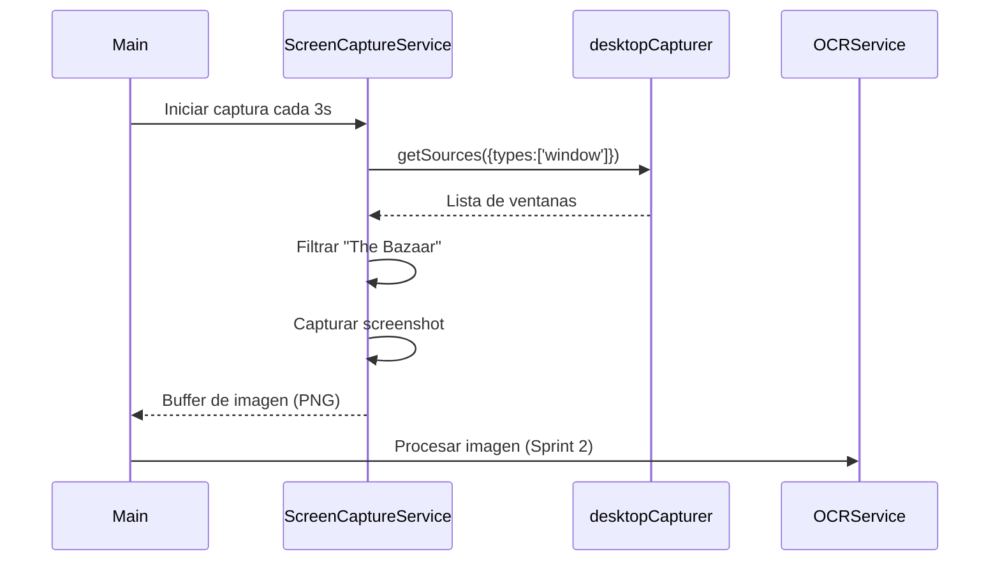

# ÉPICA 1 — Refinamiento Técnico Detallado

## 📋 Resumen Ejecutivo

**Objetivo:** Migrar proyecto Electron vanilla a Overwolf-Electron para crear una aplicación de overlay gaming con captura de pantalla y OCR.

**Duración:** Sprint 1 (Nov 17-30, 2025)  
**Complejidad Total:** 12 Story Points

---

## 🔍 Investigación Técnica Realizada

### Overwolf Framework Options

Overwolf ofrece **dos frameworks** para desarrollo de apps in-game:

1. **Overwolf Native** (HTML/JS básico)
   - Apps ligeras usando HTML5 + JavaScript
   - Manifest.json tradicional de Overwolf
   - API completa de Overwolf (overwolf.windows, overwolf.games, etc.)
   - Requiere Overwolf Desktop Client instalado

2. **Overwolf Electron** (ow-electron) ✅ **← Nuestra elección**
   - Basado en Electron.js oficial
   - White-label (sin branding Overwolf)
   - Distribución independiente (standalone installer)
   - Acceso a APIs de Overwolf + Node.js + Electron
   - Mayor flexibilidad cross-platform

### ¿Por qué Overwolf-Electron?

- ✅ Ya tenemos scaffold de Electron (fácil migración)
- ✅ Acceso completo a Node.js (necesario para Tesseract.js OCR)
- ✅ Distribución standalone (no requiere Overwolf Client)
- ✅ Branding propio (The Bazaar Tracker, no "Overwolf App")
- ✅ Mejor integración con npm ecosystem

---

## 🏗️ Stack Técnico

### Dependencias Core

```json
{
  "devDependencies": {
    "@overwolf/ow-electron": "latest",
    "@overwolf/ow-electron-builder": "latest",
    "@overwolf/electron-is-overwolf": "latest",
    "electron": "REMOVE",  // ❌ Reemplazar por ow-electron
    "@electron-forge/plugin-vite": "^7.10.2",
    "typescript": "~4.5.4",
    "vite": "^5.4.21"
  },
  "overwolf": {
    "packages": [
      "overlay"  // Habilita ventanas in-game
    ]
  }
}
```

### Paquetes Overwolf Disponibles

| Paquete | Descripción | ¿Lo usamos? |
|---------|-------------|-------------|
| `gep` | Game Events Provider - eventos nativos del juego | ❌ NO (The Bazaar no soportado) |
| `overlay` | Ventanas overlay in-game | ✅ SÍ (futuro Sprint 2/3) |
| `recorder` | Grabación de pantalla (beta) | ❌ NO (fuera de alcance) |

---

## 🎯 Decisiones Arquitectónicas

### 1. The Bazaar NO tiene soporte GEP

**Implicación:**
- ❌ NO podemos usar `overwolf.games.events` para detectar cartas automáticamente
- ✅ Debemos usar **captura de pantalla manual** con `desktopCapturer` de Electron
- ⚠️ Mayor carga de CPU/GPU vs eventos nativos

**Alternativa elegida:**
```typescript
// Usar desktopCapturer de Electron para capturar ventana del juego
import { desktopCapturer } from 'electron';

const sources = await desktopCapturer.getSources({
  types: ['window'],
  thumbnailSize: { width: 1920, height: 1080 }
});

const bazaarWindow = sources.find(s => 
  s.name.toLowerCase().includes('the bazaar')
);
```

### 2. Arquitectura de 3 Capas

```
┌─────────────────────────────────────────┐
│       Main Process (Node.js)            │
│  - Gestión de ventanas                  │
│  - IPC handlers                         │
│  - Captura de pantalla                  │
│  - Servicios background                 │
└─────────────────────────────────────────┘
                 ↕ IPC
┌─────────────────────────────────────────┐
│     Renderer Process (Chromium)         │
│  - UI React/HTML                        │
│  - Visualización de recomendaciones     │
│  - Settings panel                       │
└─────────────────────────────────────────┘
                 ↕ API
┌─────────────────────────────────────────┐
│       Overwolf Services Layer           │
│  - Analytics tracking                   │
│  - Ads (futuro monetización)            │
│  - CMP (consent management)             │
└─────────────────────────────────────────┘
```

### 3. Flujo de Captura de Pantalla



---

## 📁 Estructura de Proyecto Propuesta

```
the-bazaar-tracker/
├── src/
│   ├── main/                      # Main Process (Node.js)
│   │   ├── main.ts                # Entry point
│   │   ├── ipc-handlers.ts        # IPC communication handlers
│   │   └── windows/
│   │       └── main-window.ts     # BrowserWindow factory
│   │
│   ├── renderer/                  # Renderer Process (UI)
│   │   ├── index.html             # HTML principal
│   │   ├── renderer.ts            # Renderer entry point
│   │   ├── components/            # UI components (futuro)
│   │   └── styles/
│   │       └── index.css
│   │
│   ├── services/                  # Servicios compartidos
│   │   ├── screen-capture.service.ts  # ✅ Sprint 1
│   │   ├── ocr.service.ts             # 🔄 Sprint 2
│   │   ├── database.service.ts        # 🔄 Sprint 2
│   │   └── recommendation.service.ts  # 🔄 Sprint 3
│   │
│   ├── models/                    # Tipos TypeScript
│   │   ├── Card.ts
│   │   ├── Recommendation.ts
│   │   └── CaptureResult.ts
│   │
│   └── utils/                     # Utilidades
│       ├── logger.ts              # Sistema de logs
│       └── constants.ts           # Constantes globales
│
├── .github/
│   └── ISSUE_TEMPLATE/            # ✅ Ya creado
│
├── package.json                   # ✅ Modificar (agregar ow-electron)
├── tsconfig.json                  # ✅ Modificar (path aliases)
├── forge.config.ts                # ✅ Modificar (ow-electron-builder)
└── vite.renderer.config.ts        # ✅ OK (sin cambios)
```

---

## 🎫 User Stories Detalladas

### US 1.1 – Migrar proyecto a Overwolf-Electron

**Tareas Técnicas:**

1. **Instalar dependencias ow-electron**
   ```bash
   npm uninstall electron
   npm install --save-dev @overwolf/ow-electron @overwolf/ow-electron-builder @overwolf/electron-is-overwolf
   ```

2. **Modificar package.json**
   ```json
   {
     "name": "the-bazaar-tracker",
     "productName": "The Bazaar Tracker",
     "author": {
       "name": "Deivy Gutierrez",
       "email": "dpaul_20@hotmail.com"
     },
     "overwolf": {
       "packages": ["overlay"]
     }
   }
   ```

3. **Actualizar main.ts**
   ```typescript
   import { app as electronApp, BrowserWindow } from 'electron';
   import { overwolf } from '@overwolf/ow-electron';
   
   const app = electronApp as overwolf.OverwolfApp;
   
   app.whenReady().then(() => {
     const appId = process.env.OVERWOLF_APP_UID;
     console.log('App ID:', appId);  // Verificar unique ID
   });
   ```

4. **Configurar forge.config.ts**
   - Cambiar `@electron-forge/maker-*` por equivalentes de `@overwolf/ow-electron-builder`

5. **Testing**
   ```bash
   npm run build
   npm run start
   # Verificar: (1) No errores, (2) App ID se muestra, (3) Ventana abre
   ```

**Definition of Done:**
- [ ] `npm run start` arranca sin errores
- [ ] Console muestra: `App ID: [unique-id]`
- [ ] Ventana principal visible y funcional
- [ ] No warnings de TypeScript
- [ ] README actualizado con nuevos comandos

---

### US 1.2 – Implementar sistema de captura de pantalla

**Tareas Técnicas:**

1. **Crear `ScreenCaptureService`**
   ```typescript
   // src/services/screen-capture.service.ts
   import { desktopCapturer, NativeImage } from 'electron';
   
   export class ScreenCaptureService {
     private captureInterval: NodeJS.Timeout | null = null;
     private lastCapture: Buffer | null = null;
   
     async start(intervalMs: number = 3000): Promise<void> {
       this.captureInterval = setInterval(() => {
         this.captureGameWindow();
       }, intervalMs);
     }
   
     private async captureGameWindow(): Promise<void> {
       const sources = await desktopCapturer.getSources({
         types: ['window'],
         thumbnailSize: { width: 1920, height: 1080 }
       });
   
       const bazaarWindow = sources.find(s => 
         s.name.toLowerCase().includes('the bazaar')
       );
   
       if (!bazaarWindow) {
         console.warn('[ScreenCapture] The Bazaar window not found');
         return;
       }
   
       const thumbnail: NativeImage = bazaarWindow.thumbnail;
       this.lastCapture = thumbnail.toPNG();
       
       console.log(`[ScreenCapture] Captured: ${this.lastCapture.byteLength} bytes`);
     }
   
     getLastCapture(): Buffer | null {
       return this.lastCapture;
     }
   
     stop(): void {
       if (this.captureInterval) {
         clearInterval(this.captureInterval);
       }
     }
   }
   ```

2. **Integrar en main.ts**
   ```typescript
   import { ScreenCaptureService } from './services/screen-capture.service';
   
   const captureService = new ScreenCaptureService();
   
   app.whenReady().then(() => {
     createWindow();
     captureService.start(3000);  // Capturar cada 3s
   });
   
   app.on('will-quit', () => {
     captureService.stop();
   });
   ```

3. **Agregar IPC handler para testing**
   ```typescript
   // ipc-handlers.ts
   ipcMain.handle('get-last-screenshot', () => {
     return captureService.getLastCapture();
   });
   ```

4. **Testing en renderer**
   ```typescript
   // renderer.ts (para testing)
   const screenshot = await window.electron.ipcRenderer.invoke('get-last-screenshot');
   console.log('Screenshot size:', screenshot?.byteLength);
   ```

**Definition of Done:**
- [ ] Servicio lista todas las ventanas disponibles
- [ ] Detecta automáticamente "The Bazaar" cuando está abierto
- [ ] Captura screenshot cada 3 segundos
- [ ] Performance: < 200ms por captura (medir con `console.time`)
- [ ] Logs en consola: timestamp, tamaño buffer, nombre ventana
- [ ] Máximo 3 capturas en memoria (liberar antiguas)

---

### US 1.3 – Estructurar arquitectura modular

**Tareas Técnicas:**

1. **Crear estructura de carpetas** (ver árbol arriba)

2. **Configurar path aliases en tsconfig.json**
   ```json
   {
     "compilerOptions": {
       "baseUrl": "./src",
       "paths": {
         "@services/*": ["services/*"],
         "@models/*": ["models/*"],
         "@utils/*": ["utils/*"],
         "@main/*": ["main/*"],
         "@renderer/*": ["renderer/*"]
       }
     }
   }
   ```

3. **Crear archivos placeholder**
   ```typescript
   // src/services/ocr.service.ts
   export class OCRService {
     async processImage(buffer: Buffer): Promise<string[]> {
       // TODO: Implementar en Sprint 2
       throw new Error('Not implemented');
     }
   }
   
   // src/models/Card.ts
   export interface Card {
     id: string;
     name: string;
     type: 'item' | 'hero' | 'enchant';
     rarity: 'common' | 'rare' | 'epic' | 'legendary';
     synergies: string[];
     baseScore: number;
   }
   ```

4. **Crear logger utility**
   ```typescript
   // src/utils/logger.ts
   type LogLevel = 'debug' | 'info' | 'warn' | 'error';
   
   export class Logger {
     static log(level: LogLevel, message: string, ...args: any[]) {
       const timestamp = new Date().toISOString();
       console[level](`[${timestamp}] [${level.toUpperCase()}]`, message, ...args);
     }
     
     static debug(msg: string, ...args: any[]) { this.log('debug', msg, ...args); }
     static info(msg: string, ...args: any[]) { this.log('info', msg, ...args); }
     static warn(msg: string, ...args: any[]) { this.log('warn', msg, ...args); }
     static error(msg: string, ...args: any[]) { this.log('error', msg, ...args); }
   }
   ```

**Definition of Done:**
- [ ] Estructura de carpetas completa
- [ ] Path aliases funcionando (compilar sin errores)
- [ ] Logger utility implementado y probado
- [ ] Placeholders con interfaces TypeScript correctas
- [ ] README.md actualizado explicando estructura

---

### US 1.4 – Asegurar inicio rápido sin errores

**Tareas Técnicas:**

1. **Medir tiempo de carga**
   ```typescript
   // main.ts
   console.time('App startup');
   
   app.whenReady().then(() => {
     createWindow();
     console.timeEnd('App startup');  // Debe ser < 2000ms
   });
   ```

2. **Implementar splash screen**
   ```typescript
   let splashWindow: BrowserWindow | null = null;
   
   function createSplashScreen() {
     splashWindow = new BrowserWindow({
       width: 400,
       height: 300,
       frame: false,
       transparent: true
     });
     splashWindow.loadFile('splash.html');
   }
   
   app.whenReady().then(async () => {
     createSplashScreen();
     await initializeServices();
     splashWindow?.close();
     createMainWindow();
   });
   ```

3. **Lazy loading de módulos**
   ```typescript
   // NO hacer esto al inicio:
   // import { OCRService } from '@services/ocr.service';  ❌
   
   // Hacer esto cuando se necesite:
   async function initOCR() {
     const { OCRService } = await import('@services/ocr.service');  ✅
     return new OCRService();
   }
   ```

4. **Error boundaries**
   ```typescript
   process.on('uncaughtException', (error) => {
     Logger.error('Uncaught exception:', error);
     // No crashear, solo loguear
   });
   
   app.on('render-process-gone', (event, webContents, details) => {
     Logger.error('Renderer crashed:', details.reason);
   });
   ```

**Definition of Done:**
- [ ] Tiempo de carga < 2 segundos (promedio de 3 pruebas)
- [ ] Splash screen se muestra inmediatamente
- [ ] No hay errores/warnings en consola al iniciar
- [ ] App no crashea con errores de módulos opcionales
- [ ] Logs de inicio muestran: versión, runtime, tiempo total

---

## 📊 Métricas de Éxito del Sprint 1

| Métrica | Objetivo | Medición |
|---------|----------|----------|
| Tiempo de startup | < 2 seg | `console.time()` |
| Captura de pantalla | < 200ms | `performance.now()` |
| Uso de RAM | < 150MB idle | Task Manager |
| Cobertura TypeScript | 100% types | `tsc --noEmit` |
| User Stories completadas | 4/4 | GitHub Issues |

---

## 🚀 Siguiente Sprint (Sprint 2)

**Épicas planificadas:**
- ÉPICA 2: Sistema de Captura (OCR / Computer Vision)
- ÉPICA 3: Base de Datos de Cartas

**Handoff necesario:**
- ✅ ScreenCaptureService funcional y testeable
- ✅ Arquitectura modular lista para integrar OCR
- ✅ Buffers de imagen disponibles para procesamiento

---

## 📚 Referencias

- [OW-Electron Docs](https://dev.overwolf.com/ow-electron/getting-started/overview)
- [Sample App](https://github.com/overwolf/ow-electron-packages-sample)
- [Electron desktopCapturer API](https://www.electronjs.org/docs/latest/api/desktop-capturer)
- [Overwolf Discord](https://discord.gg/overwolf-developers)

---

**Documento creado:** 2025-11-15  
**Última actualización:** 2025-11-15  
**Sprint:** 1 (Nov 17-30, 2025)
